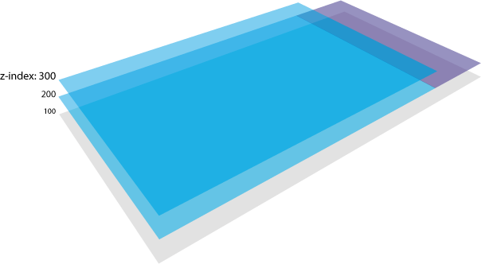

Backbone View Stack
==================

Backbone View Stack is a simple way to manage the view into web and mobile application. It is based entirely on a navigation stack.





## Demo

Coming soon...

## Dependencies

* Underscore
* Backbone

## Installation

    $ bower install backbone.viewstack --save

## API

### initialize([options])
It's the initialize of Backbone.View.

Options:

- `context` this is the context of the application. It's a global object of the application. We suggest using the package `$ bower install context-utils --save`.
- `zIndex` is the base value from where the ViewStack to increase the z-index. Default: `0`.
- `zIndexGap` is the value that indicates how much must increase the z-index for each `pushView`. Default: `100`.


### initStack
Initialize stack emptying it from view.

### clearStack([length])
It cleans up the stack up to a certain index. The `length` parameter is optional. Default: `0`. Trigger `clear` event.

### size
Return the total of views contained into stack.

### exists(classType)
Checks if there is at least one view within the stack with the `classType`.

### indexOf(view)
Return the stack index of a given instance of view.

### getView
Return the last view.

### getViewActive
Return the active view.

## getActiveViewWithOptions
Return an object

```
	{
		"view": `instance of Backbone.View`,
		"options": {
			animated: true,
			...
		}
	}
```

### getViewAtIndex(index)
Return the view at index.

### getFirstInstanceFromClassType(classType)
Return the first instance view from `classType`.

### getZIndex
Return the z-index of view stack.

### setBaseZIndex(zIndex)
Set the z-indx of start.

### getBaseZIndex
Return the z-index of start.

### pushView(view [,options])
Add an instance of a view to the ViewStack.

Options:
- `render` if `true` viewstack rendered the view after append it into the DOM. Default: `true`.
- `animatePreviousView` it indicates whether animate the previous view when deactivate. Default: `true`.
- `animated` it indicates whether the view is animated and has to wait for the end of the animation to trigger hooks. Default: `false`
- `url` it indicates the url referenced by view. It's not mandatory.


### popView([view] [,options])
Remove a view from the ViewStack. The `view` parameter is not required and if you do not pass the view it will delete the last inserted. However, it is good practice to always pass an instance of the view that you want to delete.

Options:
- `animated` it indicates whether the view is animated. If `true` the viewstack must wait until the end of the animation to trigger hooks. Default: `false`

### popViewFromClassType(classType [,options])
Remove all views having as `classType`.

### popViewToInstance(instance [,options])
Removes all view from the stack until the desired instance.

Options:
- `popInstance` if set to `true` the last instance it will in turn eliminated. Default `true`.

### popViewToIndex(index [, options])
Removes the views until the `index` parameter. It internally calls popView with `animated == false`.

Options:
- `animateLastView` if `true` the last view will be popped with animation

### refreshUrl([url])
This method update the url for the current page. If you do not pass any parameters, it compose the url scrolling through all views until the current view, calling the view's `url()` method.

## Hook
Hooks of this series are declared inside of view. They are utilities that are called from the viewstack at certain stages.

### onBeforePush
Called before adding a view to the DOM and the stack.

### onPush
Called after adding a view to the DOM and the stack.

### onBeforeActivate(firstTime)
Called before activate view. The parameter set to `true` indicates that the view has just been created and added. When is `false` indicates who is returning active.

### onActivate(firstTime)
Called when the view is active. If the view is animated, the method is only invoked after the animation is complete.

There are four ways in which the method can be called:

- Without animation. It is invoked immediately after `onBeforedeActivate`.
- Animation CSS. It is invoked after receiving the `animationend` event.
- At the end of a certain animation CSS. In this case you can tell the hook to wait the end of a given animation CSS pass it the name. The method to use is `getAnimationPushDuration` and returning a string with the name of the animation.
- Animation handled by JavaScript. To set the execution time of the animation using the `getAnimationPushDuration` method to return a time in milliseconds.

### onBeforeDeactivate
Called before deactivate view. In this case it is not destroyed and removed from the DOM but it is only in the background. One suggestion is to disable events of any scroll the view and this phase.

### onDeactivate
Called when the view is deactivate. If the view is deactivate with animation ( `viewstack.popView(myView,{animated: true})` ), the method will only be invoked after the animation is complete.

There are four ways in which the method can be called:

- Without animation. It is invoked immediately after `onBeforeDeactivate`
- Animation CSS. It is invoked after receiving the `animationend` event.
- At the end of a certain animation CSS. In this case you can tell the hook to wait the end of a given animation CSS pass it the name. The method to use is `getAnimationPopDuration` and returning a string with the name of the animation.
- Animation handled by JavaScript. To set the execution time of the animation using the `getAnimationPopDuration` method to return a time in milliseconds.

### onBeforePop
Called before remove from DOM.

### onPop
Called after remove view from DOM and stack.

### getAnimationPushDuration
Return the millisecond (number) or name of animation (string).

### getAnimationPopDuration
Return the millisecond (number) or name of animation (string).

## Usage

```javascript

var _         = require("underscore");
var BackBone  = require("backbone");
var ViewStack = require('viewstack');

// Declare a Home page view
var HomePageView = new Backbone.View({

	className: 'home-page',

	initialize: function initialize(options) {
		this.options = _.defaults(options||{}, {title: ''});
	},

	render: function render() {

		this.$el.empty().html( '<h1>' + this.options.title + '</h1>' );

		return this;
	},

	destroy: function destroy() {
		if (this.options.removeOnDestroy)
			this.remove();
		else {
			this.undelegateEvents();
		}
		this.off();
		if (this.onDestroy)
			this.onDestroy();
	},

	onBeforePush: function() {
		console.log("onBeforePush");
	},

	onPush: function() {
		console.log("onPush");
	},

	onBeforeActivate: function() {
		console.log("onBeforeActivate");
	},

	onActivate: function() {
		console.log("onActivate");
	},

	onBeforeDeactivate: function() {
		console.log("onBeforeDeactivate");
	},

	onDeactivate: function() {
		console.log("onDeactivate");
	},

	onBeforePop: function() {
		console.log("onBeforePop");
	},

	onPop: function() {
		console.log("onPop");
	}

});


// Initialize stack width elememt id
var viewStack = new ViewStack({ el: "#application" });
viewStack.clearStack(); // Empty stack view
viewStack.render(); // Render view

// Create a view
var hpView = new HomePageView({
	title: 'Hello World!!'
});

viewStack.pushView( hpView ); // Push a view

setTimeout(function(){
	viewStack.popView( hpView ); // Pop a view
}, 5000);

```


## Licence

Released under MIT License (MIT) Copyright (c) 2014-2018 Matteo Baggio & Michele Belluco
